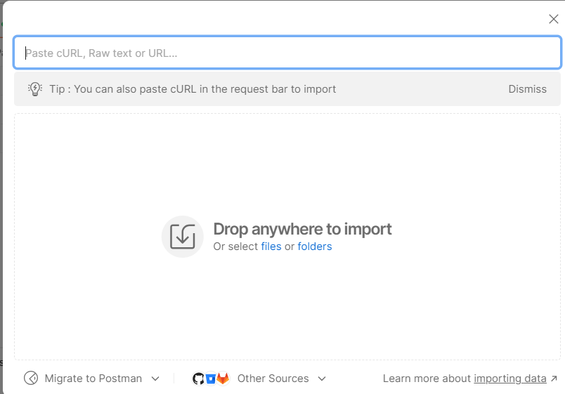

# **Desafio Backend for Frontend (BFF) CoinGecko**

Este repositório é referente ao desafio técnico back-end do edital 002/2024, para compor a equipe do DAD - DEVELOPER ACADEMY DASHBOARD (342024), em parceria com o  LABORATÓRIO DE COMPUTAÇÃO MÓVEL E UBÍQUA e com o IMD. O backend para frontend (BFF) foi desenvolvido para consumir a API do **CoinGecko** e expor endpoints otimizados para listagem de criptomoedas, resumo do mercado e histórico de preços. O projeto inclui um serviço de autenticação de usuários, com funcionalidades de login e registro.

---

## **Índice**

1. [Requisitos](#requisitos)
2. [Clonando o Repositório](#clonando-o-repositório)
3. [Configuração do Ambiente](#configuração-do-ambiente)
4. [Rodando o Projeto com Docker Compose](#rodando-o-projeto-com-docker-compose)
5. [Utilizando o Postman](#utilizando-o-postman)
6. [Testando a API](#testando-a-api)
7. [Estrutura do Projeto](#estrutura-do-projeto)

---

## **Requisitos**

Para rodar este projeto, você precisa ter:

- **Docker**: Para rodar os containers de banco de dados e aplicação.
- **Postman**: Para testar a API de forma interativa.
- **Python 3.10+** (opcional, caso não queira usar Docker).

---

## **Clonando o Repositório**

   **Clone o repositório** usando o seguinte comando:

   ```bash
   git clone https://github.com/seu_usuario/bff-coingecko.git
   cd bff-coingecko
   ```

## **Configuração do Ambiente**
   
   **Crie o .env** usando o .env.example como exemplo:

   ```bash
   COINGECKO_API_KEY=         //sua api_key do coingecko
   FASTAPI_DEBUG=             //True ou False para ativar ou desativar as documentações do FAPI
   DB_USERNAME=               //arbitrário
   DB_PASSWORD=               //arbitrário
   ```

## **Rodando o Projeto com Docker Compose**

   **Rode os containers** com o .env criado, rode os comandos:

   ```bash
   docker-compose build --no-cache    
   docker-compose up
   ```

## **Utilizando o Postman**

   **Importe a coleção** que está dentro do diretório bff-coingecko-dad/postman:

   

## **Testando a API**

   **Inicie o teste** rodando o endpoint SIGN-UP (POST) para cadastrar um usuário:

   

   Em seguida pode utilizar os demais endpoints

## **Estrutura do Projeto**

   A estrutura do projeto foi organizada de forma modular, visando facilitar a manutenção, expansão e escalabilidade. A seguir, apresento a explicação de cada diretório e arquivo importante na raiz do repositório:

   ### **Descrição das principais pastas e arquivos**:

- **`src/`**: Contém o código fonte da aplicação.
  - **`controllers/`**: Aqui ficam os arquivos responsáveis pelos endpoints da API. Cada controlador é responsável por um grupo de endpoints. Por exemplo, `user_controller.py` contém as rotas para registro de usuário e login.
  - **`models/`**: Contém os modelos de dados que interagem diretamente com o banco de dados utilizando **SQLAlchemy**. Esses modelos definem as tabelas do banco e suas relações.
  - **`schemas/`**: Define os esquemas de validação de dados usando **Pydantic**. São usados para validar e serializar dados de entrada e saída nas requisições HTTP.
  - **`services/`**: Contém a lógica de negócios e as interações com sistemas externos, como o consumo da API CoinGecko ou lógica de autenticação.
  - **`config/`**: Diretório com as configurações gerais da aplicação, incluindo o banco de dados, configurações de segurança e outras variáveis de ambiente.
  - **`repositories/`**: Este diretório é responsável pela interação com a API externa CoinGecko. Aqui, são montadas as requisições HTTP para buscar dados do mercado de criptomoedas, histórico de preços e outras informações relacionadas ao CoinGecko.
  - **`main.py`**: Arquivo de inicialização da aplicação. Aqui, a instância do **FastAPI** é configurada e os controladores são registrados.

- **`Dockerfile`**: Arquivo que define a construção da imagem Docker da aplicação. Ele contém instruções para instalar dependências, copiar o código fonte e expor a aplicação.
  
- **`docker-compose.yml`**: Arquivo que orquestra a criação de containers Docker para rodar a aplicação e o banco de dados PostgreSQL em conjunto. Ele simplifica o processo de inicialização de múltiplos serviços.
  
- **`.env`**: Arquivo de variáveis de ambiente que configura a conexão com o banco de dados e outros parâmetros da aplicação (como a chave da API do CoinGecko).
  
- **`.env.sample`**: Um arquivo de exemplo contendo a estrutura do `.env`, mas com valores fictícios ou placeholders. Útil para novos desenvolvedores entenderem as variáveis necessárias sem expor valores reais.

- **`postman/collection.json`**: Arquivo que descreve a API no formato **OpenAPI**. Este arquivo pode ser importado diretamente no **Postman** ou outras ferramentas para visualizar e testar a API.

- **`poetry.lock`** e **`pyproject.toml`**: Arquivos de configuração do **Poetry**, o gerenciador de dependências e ambientes do Python. O `pyproject.toml` lista as dependências do projeto e o `poetry.lock` garante que as versões corretas das dependências sejam instaladas.

- **`README.md`**: Este arquivo de documentação, que contém informações importantes sobre o projeto, como como configurá-lo, rodá-lo, e interagir com a API.

- **`tests/`**: Diretório contendo os testes automatizados do projeto, organizados por funcionalidade. Cada arquivo de teste foca em um aspecto diferente da aplicação, garantindo que a lógica do código esteja funcionando corretamente.

---

### **Fluxo de Trabalho**

1. **Configuração Inicial**: Ao clonar o repositório, crie um arquivo `.env` com as variáveis de ambiente para a configuração do banco de dados e da API do CoinGecko.
   
2. **Subindo o Projeto**: Use o Docker Compose para levantar a aplicação e o banco de dados com o comando `docker-compose up --build`.

3. **Testes**: Utilize a pasta `tests/` para rodar os testes automatizados com `pytest` ou escreva testes adicionais conforme necessário.
---