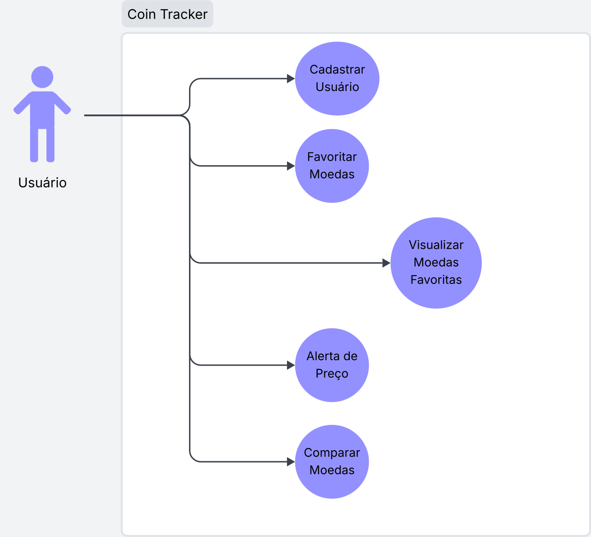

# **Casos de Uso**

## **Cadastrar Usuário**

* Usuários devem ser capazes de se cadastrar usando e-mail/username e senha.

---

## **Favoritar Moedas**
* Usuários logados devem ser capazes de procurar e favoritar moedas

---

## **Visualizar Moedas Favoritas**
* Usuários logados devem ser capazes de ver um resumo do desempenho de suas moedas favoritas.

---

## **Visualizar Histórico de Preços**

* Usuários devem poder visualizar o histórico de preços de uma criptomoeda.

---

## **Comparar Moedas**

* Usuários devem poder visualizar a comparação entre criptomoedas.

---

# **Diagrama**

